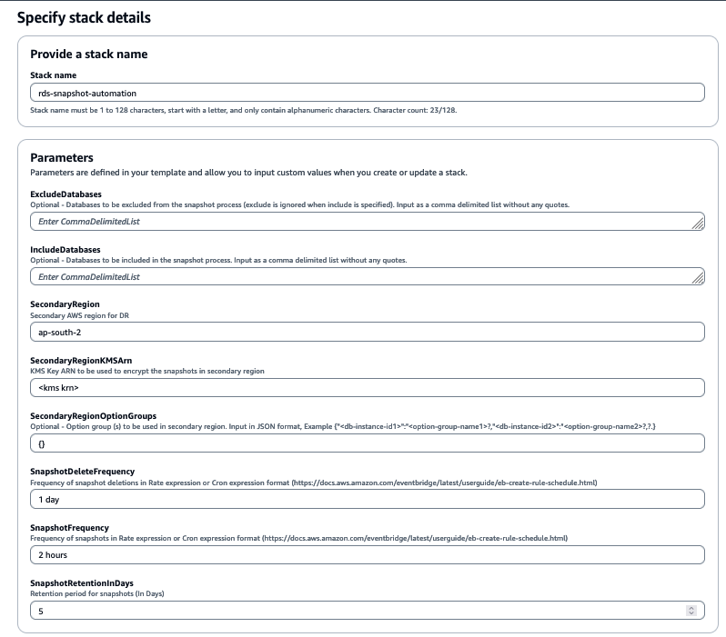

# Automation of RDS snapshots for cross region disaster recovery

## Context
Disaster recovery (DR) is the process by which an organization anticipates and addresses technology-related disasters. The process of preparing for and recovering from any event that prevents a workload or system from fulfilling its business objectives in its primary deployed location, such as power outages, natural events, or security issues. Disaster recovery targets are measured with Recovery Point Objectives (RPO) and Recovery Time Objectives (RTO).

Customers with RTO and RPO in hours look for backup and restore based DR strategy as a cost effective solution. AWS Backup is a cost-effective, fully managed, policy-based service that simplifies DR strategy in same region as well as well as across the regions. However, AWS Backup is not available in all the regions and it does not support cross region copy of RDS backups if a custom option group is used. Customers use custom option groups for RDS in scenarios such as TDE and Timezone configurations etc.

References:

https://docs.aws.amazon.com/aws-backup/latest/devguide/troubleshooting.html

https://docs.aws.amazon.com/aws-backup/latest/devguide/backup-feature-availability.html

For scenarios where AWS backup cannot be used because of region availability or requirement of custom option group etc., the solution is to schedule RDS manual snapshots to run at regular intervals and perform a cross region to ensure cross region DR strategy. As this is not configurable feature with RDS, customers need to write custom automation.

The solution in this code sample is intended to solve that challenge. It can be used as a getting started code sample for automation and orchestration of cross region disaster recovery using AWS Lambda and EventBridge.

## Pre-requisites
1. A user with access to AWS Console and access to services such as CloudFormation, Lambda, IAM, EventBridge and RDS etc.	
2. [Optional] Custom option group (s) in the secondary region with exact same settings as primary region (such as timezone or tde etc.).
3. KMS key in the secondary region.

Please note that this is just a getting started guide for the automation of RDS manual snapshots for the purpose of cross region disaster recovery. You are strongly encouraged to follow the security best practices related to [IAM](https://docs.aws.amazon.com/lambda/latest/dg/best-practices.html#security-best-practices), [Lambda](https://docs.aws.amazon.com/IAM/latest/UserGuide/best-practices.html) and other services used in the solution.

## Step by step guide
Clone the git repository by executing the below command on Terminal. Refer to [github documentation](https://docs.github.com/en/repositories/creating-and-managing-repositories/cloning-a-repository) for more details.

```
git clone https://github.com/aws-samples/rds-cross-region-snapshot
```

The repository contains a AWS CloudFormation template named **rds-cross-region-snapshot-cft**. Use the below steps to deploy that in the required AWS account:

1. Open the AWS CloudFormation console at https://console.aws.amazon.com/cloudformation.
2. Create a new stack by choosing **Create Stack**.
3. In the **Specify template** section, choose **Upload a template file** option, upload the file named **rds-cross-region-snapshot-cft** and choose Next.

4. In the **Specify stack details** step, input **Stack name**, parameters and choose Next.
 
5. Leave everything as default in **Configure stack options** step and choose Next.
6. In **Review and create** step, scroll down to the bottom, acknowledge **I acknowledge that AWS CloudFormation might create IAM resources** and choose **Submit**.


## Gotchas / Limitations
1. Creating RDS snapshot for a Single-AZ DB instance results in a brief I/O suspension that can last from a few seconds to a few minutes, depending on the size and class of your DB instance. Usually it only increases the latency for few seconds when the snapshot is about to complete but something to watch out for. [Reference documentation](https://docs.aws.amazon.com/AmazonRDS/latest/UserGuide/USER_CreateSnapshot.html)
2. When you copy a snapshot to a different AWS Region from the source snapshot, the first copy is a full snapshot copy, even if you copy an incremental snapshot. A full snapshot copy contains all of the data and metadata required to restore the DB instance. After the first snapshot copy, you can copy incremental snapshots of the same DB instance to the same destination Region within the same AWS account. [Reference documentation](https://docs.aws.amazon.com/AmazonRDS/latest/UserGuide/USER_CopySnapshot.html)
3. The DB instance must be in Available state and no other manual snapshot for the same instance should be running for the snapshots to occur. The retries have been added to lambda function to ensure it doesn’t cause any issues.
4. By default, 100 is the maximum number of manual DB snapshots which can be there in a region. It is an adjustable limit. However it may still be required to adjust retention period and snapshot frequency to ensure that the limit is not hit.
5. This solution currently does not support RDS DB clusters i.e. Aurora Multi-AZ with two readable standby etc.

## Security

See [CONTRIBUTING](CONTRIBUTING.md#security-issue-notifications) for more information.

## License

This library is licensed under the MIT-0 License. See the LICENSE file.

